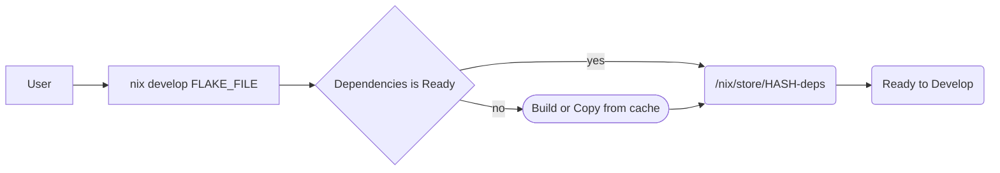

<h1 id="toc">DVT - Development Tools</h1>
  

  Development Tools and Templates 🛠️ ⚙️ 🔭 ❄️⛷️
  

  <a href="#overview"><strong>Overview</strong></a>  • 
  <a href="#usage"><strong>Usage</strong></a>  • 
  <a href="#contributions"><strong>Contributions</strong></a>

## Overview

[[Back to the Table of Contents] ↑](#toc)

<!-- TODO -->

## Usage

[[Back to the Table of Contents] ↑](#toc)

In this section is require nix installed in your system, here steps to install: 

> you can **SKIP** this section when nix has been installed in your system and go use as [development environment](#as-development-environment), [project development environment](#as-project-development-environment), or [create new project with available template](#as-project-boilerplate).

* Install nix in your system
  * run command: `curl --proto '=https' --tlsv1.2 -sSf -L https://install.determinate.systems/nix | sh -s -- install`
  * OR [Read Here for more details](https://zero-to-nix.com/start/install#up)

### Templates

> available templates and development environments.

| NAME                | Lang/Framework/Tools                      |
| -------------       | -------------                             |
| [node](./node)      | `nodejs@v18`, `yarn@1.22`, `pnpm@7`       |
| [node14](./node14)  | `nodejs@v14`, `yarn@1.22`, `pnpm@5`       |
| [go](./go)          | `go@v1.19`, `gotools`, `golangci-lint`    |

* using as development environment: `nix develop github:efishery/dvt?dir=<NAME>`

### As Development Environment

* Select the _development environment_ `<NAME>` from [templates](#templates).
* Run command: `nix develop github:efishery/dvt?dir=<NAME>` 
  * example for _**node**_: `nix develop "github:efishery/dvt?dir=node"` with default shell is [Bash](https://www.gnu.org/software/bash/).
    * `nodejs@v18.x` , `yarn@1.22.x`, and `pnpm@7.x` will ready to use in your local $SHELL.

### As Project Development Environment

* Go to your existing project directory.
* Select the _development environment_ `<NAME>` from [templates](#templates).
* Run command: `nix flake -t github:efishery/dvt#<NAME>`
  * example for _**node**_: `nix flake init -t github:efishery/dvt#node`
  * in your project will contains all files from [node](./node).

### Usefull Command Flags

* `-c <ENV_VAR>`
  * maybe, in your local shell have been use `zsh`, `fish`, `ksh`, `csh`, or `powershell`. example run devshell with your current $SHELL:
  * `nix develop github:efishery/dvt?dir=<NAME> -c $SHELL`
* `--refresh`
  * maybe, in `efishery/dvt` have been update the repository and you want to stay up to date. so, run development environment with flag `--refresh`.
  * `nix develop github:efishery/dvt?dir=<NAME> --refresh` - run devshell with your current $SHELL

<!-- TODO
### As Project Boilerplate

* Select availables project templates name in the tables.
  * run command `nix flake -t github:efishery/dvt#<NAME>`
  * example for _**react-native@0.71**_: `nix flake init -t github:efishery/dvt#rn71`
-->

## Contributions

[[Back to the Table of Contents] ↑](#toc)

### For Code Contributors

* [Learning: Nix flake](https://zero-to-nix.com/concepts/flakes)
* [Learning: Explore Nix development environments](https://zero-to-nix.com/start/nix-develop)
* [Learning: Search for Nix packages](https://zero-to-nix.com/start/nix-search)
* [Learning: Nix Language quirks](https://nixos.wiki/wiki/Nix_Language_Quirks)
* [Learning: How Nix Works](https://nixos.org/guides/how-nix-works.html)

<!-- TODO 

### Request

-->

## Acknowledgement

* [Nix](https://nixos.org)
* [dev-templates](https://github.com/the-nix-way/dev-templates)

[[Back to the Table of Contents] ↑](#toc)
